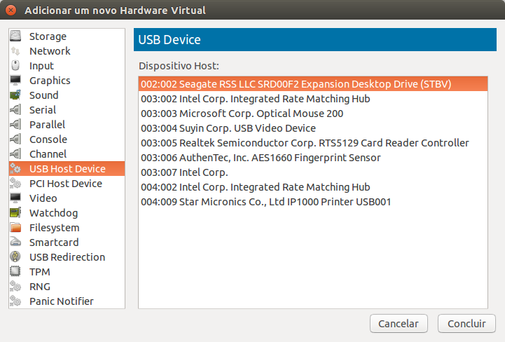

Adicionando dispositivos USB
======

No KVM com LibVirt é possível adicionar dispositivos e controladoras 
**USB físicas** as suas máquinas virtuais. Para isso basta clicar duas
vezes em cima de uma máquina virtual e ir em `Add Hardware`.

Selecione a opção `USB Host Device` e selecione um dispositivo /
controladora e clique em `Concluir`. O dispositivo deve ficar
disponível imediatamente na sua máquina virtual.