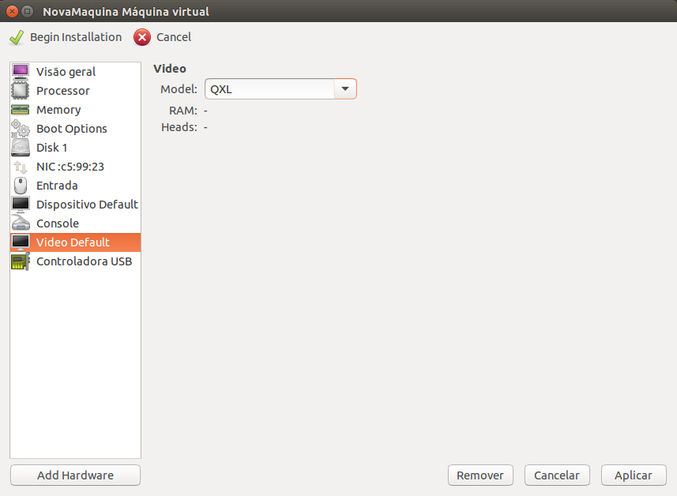
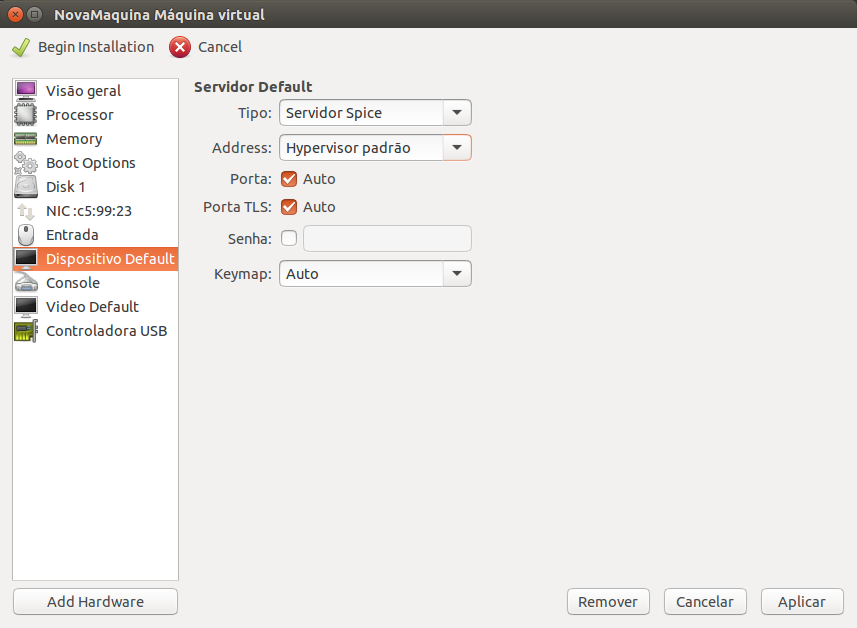

Configurações de Vídeo
======

Para maior velocidade da interface gráfica configure o `Model` para `QXL`.
Em máquinas Windows será necessária a instalação do driver de vídeo para
a melhor performance. Apesar disso, o sistema deve funcionar normalmente 
com a placa de vídeo `QXL`.

Configurações de Acesso
======

Configure o `Dispositivo de Acesso` para o tipo `Servidor Spice`. Esse
tipo de acesso é mais rápido e prático, além de ter maiores capacidades
como USB Remoto e Redimensionamento de janela.