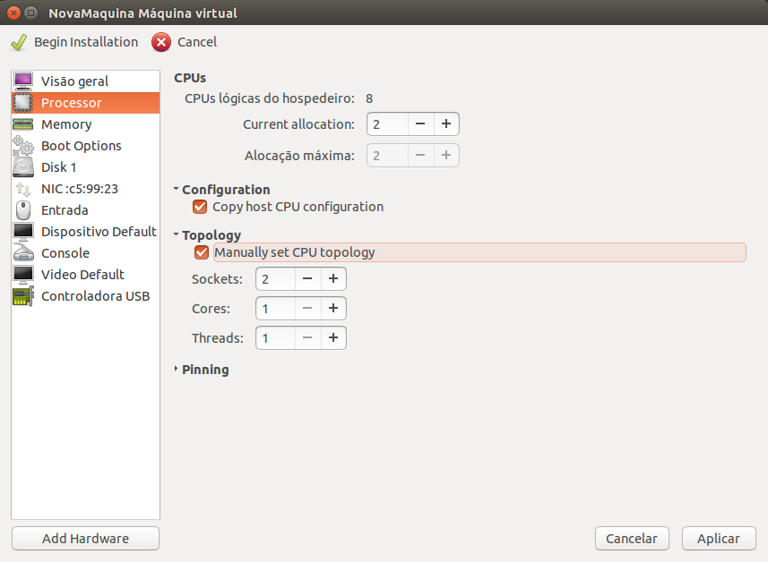

Configuração de CPU
=================

Nesta tela você poderá configurar as CPUs virtuais de sua máquina. Para uma
maior velocidade, selecione a opção `Copy host CPU configuration` para que 
a CPU virtual tenha as mesmas capacidades da sua CPU física.

Para máquinas Windows em que seja necessário mais de 4 CPUs é necessário configurar
a Topologia para que as CPUs sejam denominadas como **Cores** e não **Soquetes**.
Isso é necessário pois a maioria dos Windows só tem licença para 4 processadores 
físicos (as vezes até menos), porém não há limitação para número de cores. Para
isso basta selecionar a opção `Manually set CPU topology` e preencher os valores
de **Sockets** como **1**, **Cores** para o número de núcleos desejado, **Threads**
para número de Threads por Core (Hyper Threading).

Feito isso, clique em `Aplicar`