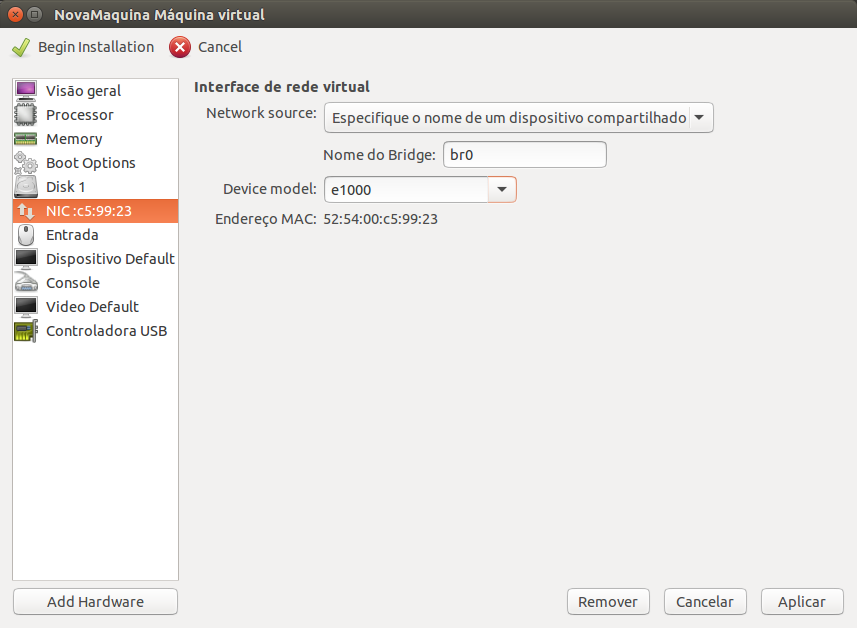

Configurando Placa de Rede
=========

Nesta tela certifique-se de ter selecionado em `Network Source` a opção
conectada a interface `br0` **ou** selecionado conforme a foto `Especifique
um dispositivo compartilhado` e o `Nome do Bridge` como `br0`.

Certifique-se também de o `Device Model` estar em **e1000** para que máquinas
Windows possam ser instaladas normalmente. Para máquinas linux a melhor 
performance fica na opção **VirtIO** (após a instalação do Windows também
é possível ativar o modo **VirtIO** com a instalação dos drivers do KVM)