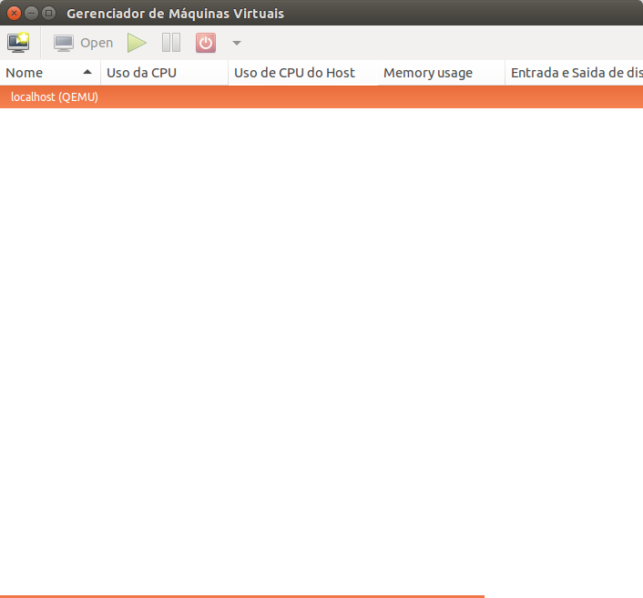
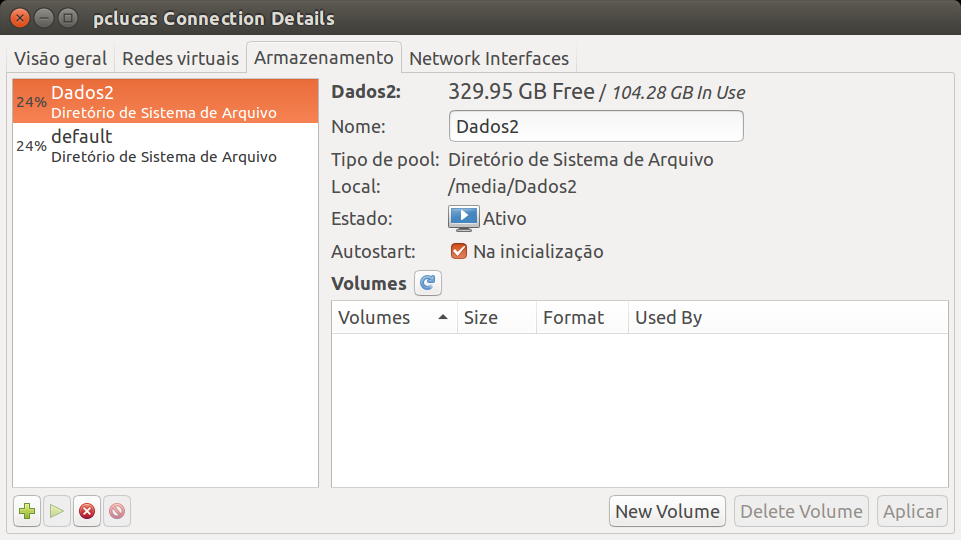
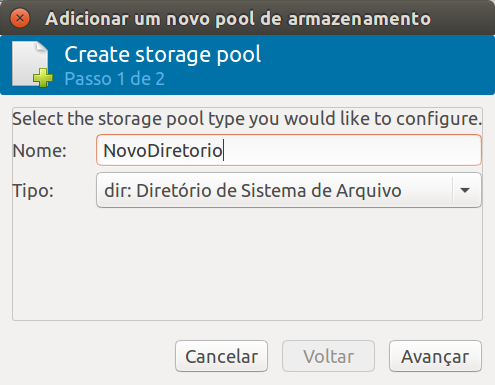
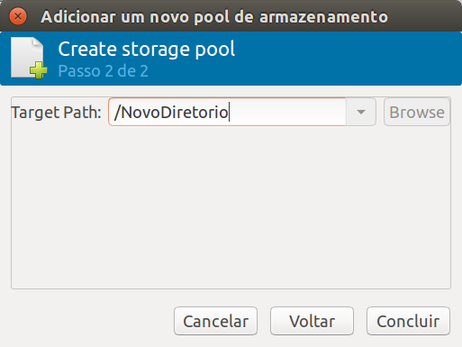
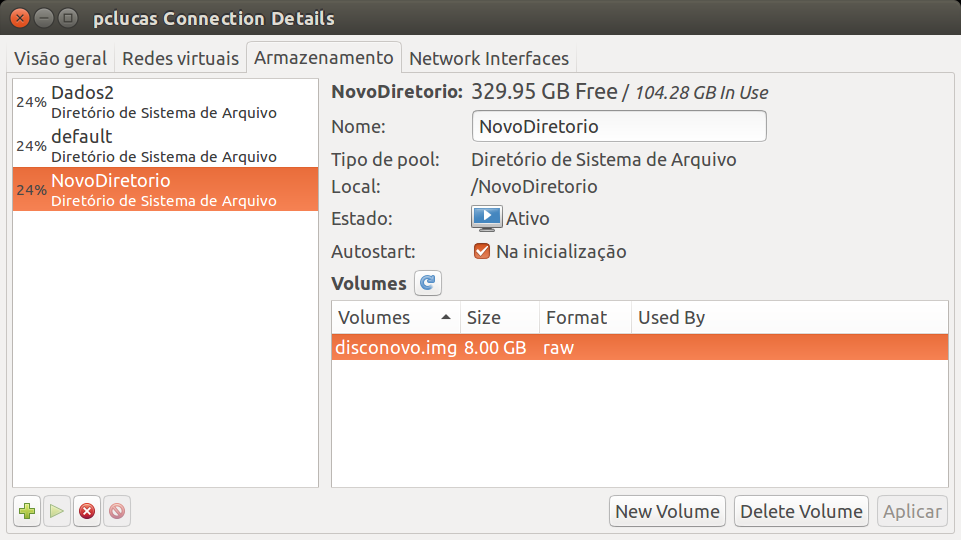

Criando Pasta Alternativa de Imagens de Disco
=========

Para criar uma pasta alternativa para o KVM armazenar as imagens de disco
vá para tela principal do `Gerenciador de Máquinas Virtuais`

e clique duas vezes na opção `localhost (QEMU)` e vá para a opção 
`Armazenamento`.

Nesta tela clique no botão **+** no canto esquerdo inferior para 
inserir um novo **Storage Pool**.

Selecione um nome para o seu novo **Storage Pool** e deixe a opção
`dir: Diretório do Sistema de Arquivo` selecionado. Clique em `Avançar`.

Selecione o caminho para onde você quer que as imagens sejam armazenadas,
e clique em `Concluir`.

Com o novo **Storage Pool** criado, você poderá criar imagens de disco
dentro dele  clicando no botão `New Volume` e criando o seu disco 
normalmente. Após isso ele deve aparecer no seu novo **Storage Pool**

