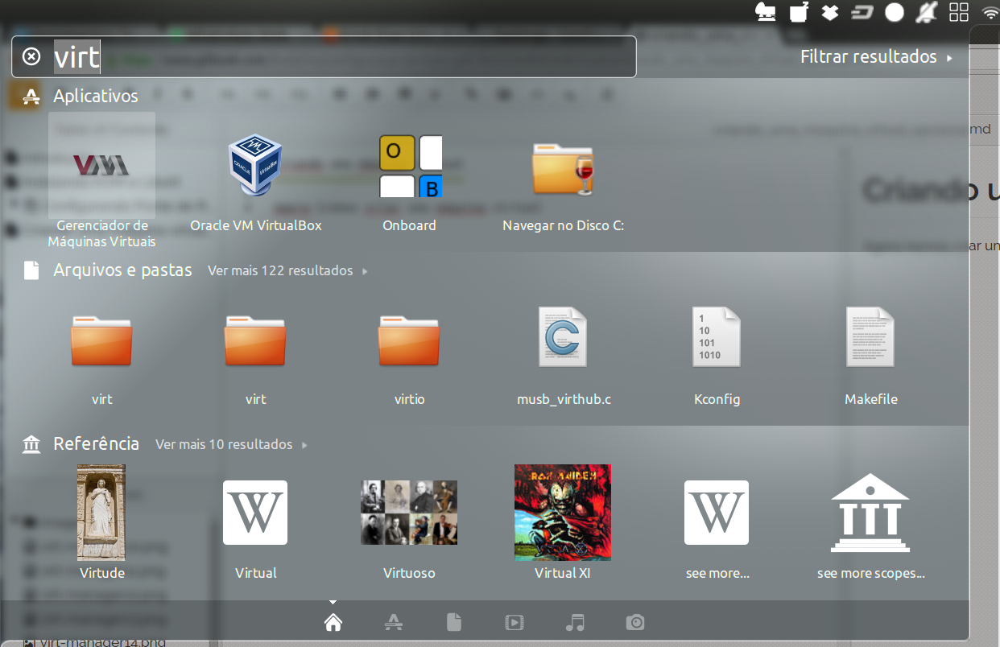

Criando uma máquina virtual
===========================

Agora iremos criar uma máquina virtual. Para isso vá ao menu **HOME**
(clicando no primeiro botão do menu ou apertando a tecla **WINDOWS**)
e escreva **virt** e selecione **Gerenciador de Máquinas Virtuais**

