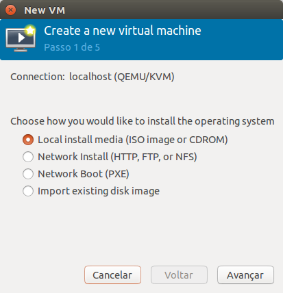

Criando uma máquina virtual
===========================

Agora iremos criar uma máquina virtual. Para isso vá ao menu **HOME**
(clicando no primeiro botão do menu ou apertando a tecla **WINDOWS**)
e escreva **virt** e selecione **Gerenciador de Máquinas Virtuais**

Aberto o gerenciador, você irá se deparar com uma tela similar a essa

Selecione a opção `localhost (QEMU)` e clique no botão esquerdo superior 
para criar uma nova máquina virtual.

