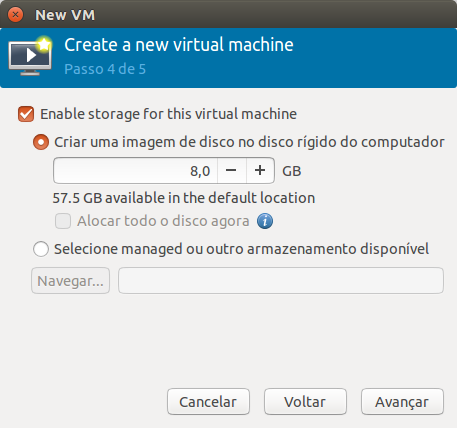

Criando uma máquina virtual
===========================

Agora iremos criar uma máquina virtual. Para isso vá ao menu **HOME**
(clicando no primeiro botão do menu ou apertando a tecla **WINDOWS**)
e escreva **virt** e selecione **Gerenciador de Máquinas Virtuais**

Aberto o gerenciador, você irá se deparar com uma tela similar a essa

Selecione a opção `localhost (QEMU)` e clique no botão esquerdo superior 
para criar uma nova máquina virtual.

Nesta tela selecione a opção `Local install media (ISO Image or CDROM)`.

Nesta tela selecione a origem da mídia que deseja usar para instaĺação
(ISO ou CDROM) e também selecione o sistema operacional desejado. Caso
não haja opção do seu sistema operacional, selecione a que mais se 
aproxima do seu sistema operacional.

Selecione o quanto de memória e CPU é desejado na máquina virtual.
Valores maiores do que os disponíveis no sistema não são recomendados,
embora sejam possíveis (overcommit).

Selecione aqui se deseja criar um novo disco ou se deseja selecionar
um disco existe. Se deseja criar o disco em um lugar não padrão, veja 
a seção [Criando Pasta Alternativa de Imagens de Disco](criando_pasta_alternativa_de_imagens_de_disco.md).
