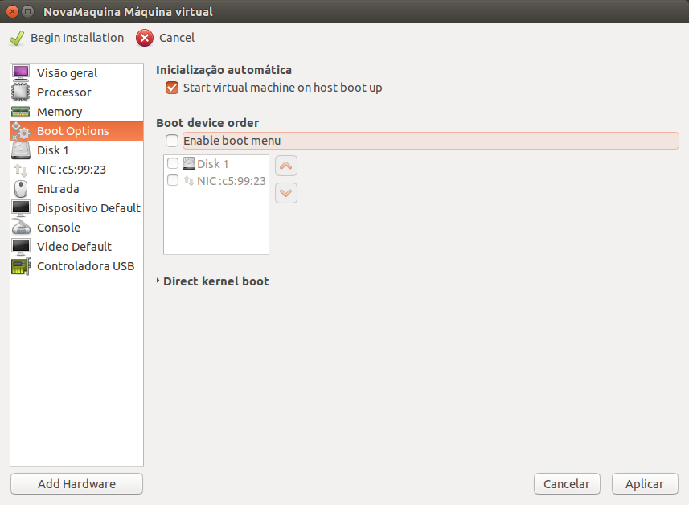

Iniciar a máquina no **boot**
=========

Para inicializar a máquina junto com o **host** basta selecionar 
a opção `Start virtual machine on host boot up` e ela será inicializada
automaticamente na hora do boot.

Nesta tela também há a opção de selecionar o dispositivo de boot 
prioritário.