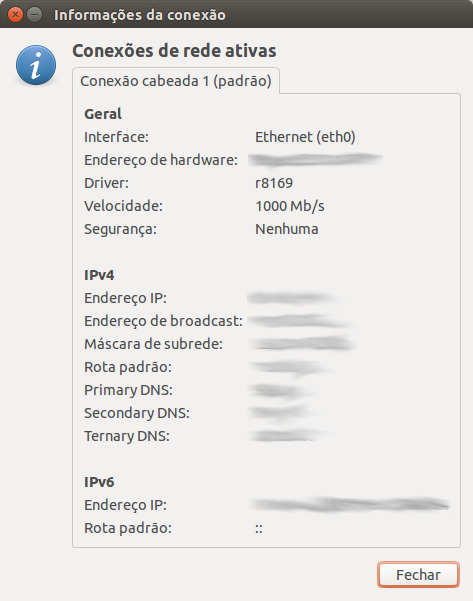

## Pela interface Gráfica (NetworkManager)

Este é outro método simples. Para ver qual o dispositivo pela interface gráfica
conecte o cabo na interface desejada, e vá no **ícone de rede** na barra superior,
e em **Informações da Conexão**

Feito isso uma janela nova irá abrir com as informações das conexões ativas.
Na linha `Interface` está descrita qual o dispositivo de rede.

    Interface: Ethernet (eth0)
    
**eth0** é o nosso dispositivo