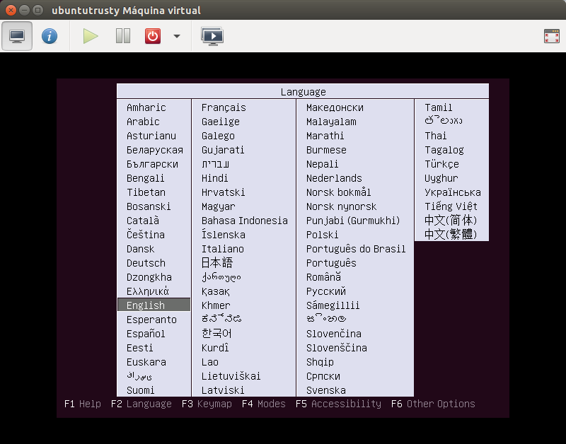

Rodando a máquina
=======

Feito tudo isso, clique no botão `Begin Installation` no canto superior
esquerdo e você irá ser redirecionado para a tela da máquina virtual
já rodando.

Faça sua instalação normalmente.